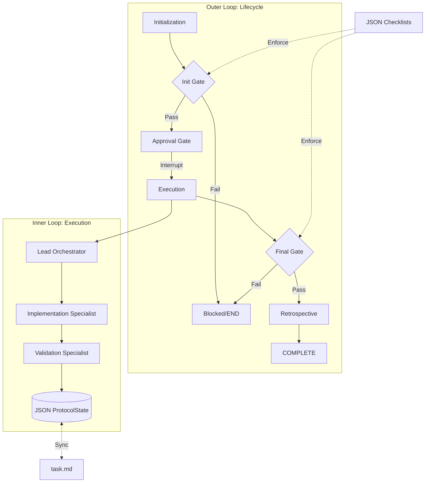

# Agentic Protocol Harness

Standard Agentic Protocol (SAP) Harness for AI Agent Orchestration.

A flexible, two-tier agent orchestration framework designed for reliable, SOP-compliant software development. The harness ensures that agents follow best practices (SDD, TDD) via automated safety gates and data-driven SOP validation.

## 🚀 Two-Tier Architecture

The harness operates on two distinct loops to balance execution speed with process integrity.

### 🔄 The Outer Loop (Orchestration & Compliance)

Built on **LangGraph**, the outer loop manages the full project lifecycle. It enforces the **Standard Operating Procedure (SOP)** by routing the workflow through specific phases:

1. **Initialization**: Environments are prepared, and prerequisites are verified.
2. **Approval**: A human-in-the-loop gate (using LangGraph interrupts) ensures the plan is sound before execution starts.
3. **Execution**: The heavy lifting is delegated to specialized agent teams.
4. **Finalization**: Quality gates verify that code is tested, committed, and documented.
5. **Retrospective**: Captures lessons learned to improve future sessions.

### ⚙️ The Inner Loop (Stateless Execution)

The internal engine for agent work. Originally driven by markdown files, the inner loop now leverages a **JSON-persisted state ledger (`ProtocolState`)**. This allows for:

- **Programmatic Control**: Precise tracking of goals, facts, and discovered steps.
- **Resumability**: SQLite-backed checkpointing allows processes to pause and resume without losing context.
- **Human Oversight**: Continuous synchronization with `task.md` ensures humans can still monitor and edit the task list.

## 🛡️ SOP Enforcement & Safety Gates

Compliance is not just a suggestion; it is built into the workflow's graph topology.

### Safety Gates via Conditional Edges

The orchestration graph uses **conditional edges** to evaluate agent work. If a phase-specific check fails (e.g., a "BLOCKER" like uncommitted code or missing tests), the graph routes the process to `END`, effectively "freezing" the agent until the issue is resolved.

### JSON-Driven Validation

We transitioned from hardcoded checklists to **data-driven JSON validation** (located in `.agent/rules/checklists/`) for several key reasons:

- **Transparency**: Agents and humans share the same source of truth for "what constitutes done."
- **Extensibility**: Project-specific rules can be added by simply creating or editing JSON files without modifying the core harness code.
- **Schema Validation**: Rules are strictly typed, reducing the risk of checklist drift or ambiguity.

## 🛠️ Best Practices & Parallel Development

- **SDD & TDD First**: The harness requires an Implementation Plan (SDD) and passing tests (TDD) before work can be finalized.
- **Parallel Non-Conflicting Development**: By strictly coupling git branches to **Beads (`bd`)** issue IDs, the harness prevents "orphan work" and minimizes merge conflicts in multi-agent environments.
- **Extendable Rules**: Users can add custom validators by registering new functions in `compliance.py` and referencing them in the JSON checklists.

## 📊 System Overview



## 🛠️ Development Tools

### Local CI Simulation

To catch failures before pushing to GitHub, run the local CI simulation script. This script runs linting (Ruff), formatting, security audits (Bandit), and the full test suite (Pytest).

```bash
./scripts/ci-local.sh
```

### Pre-commit Hooks

The harness uses `pre-commit` to ensure code quality at commit time.

```bash
pre-commit install
```

#### Agent Harness Git Hooks

This project includes git hooks for cleanup enforcement.

**Installation:**

```bash
bash .harness/install_hooks.sh
```

**Features:**
- Pre-commit cleanup validation (blocks temp files like `*.tmp`, `debug_*`, `*.db`)
- Extensible component architecture

**Local CI Simulation:**

```bash
bash .harness/scripts/simulate-ci-cleanup.sh
```

**Configuration:**
Edit `.harness/cleanup_patterns.txt` to add/remove patterns.

### CI/CD Enforcement

PRs are automatically validated for temporary files before merge via `.github/workflows/cleanup-validation.yml`.

**What happens when validation fails:**
1. PR check fails with ❌ status
2. Bot comments with list of violating files  
3. Merge button is blocked
4. Developer must remove files and push

### Session Cleanup Enforcement (agent-6x9.3)

The agent harness enforces workspace cleanup at two checkpoints via `check_protocol_compliance.py`:

**1. Session Start (Soft Enforcement)**
```bash
python check_protocol_compliance.py --init --mode simple --issue agent-6x9
```
- Scans for leftover artifacts from previous sessions
- If found: warns and offers cleanup options
- Creates session lock

**2. Session End (Hard Enforcement)**
```bash
python check_protocol_compliance.py --close
```
- Validates workspace is clean
- Blocks closure if violations exist
- Removes session lock

**Check Status:**
```bash
python check_protocol_compliance.py --status
```

**Force Close (Emergency):**
```bash
python check_protocol_compliance.py --close --skip-validation
```
⚠️ Warning: This bypasses enforcement.

## 📦 Core Libraries

- **LangGraph**: Workflow orchestration and state management.
- **Pydantic**: Robust schema definition for the `ProtocolState`.
- **SQLite**: Reliable persistent checkpointing.
- **Beads**: Issue tracking and branch-issue coupling.

## 📜 License

MIT
