# Agentic Protocol Harness

**A production-grade orchestration framework for AI agents that enforces software development best practices through automated validation and safety gates.**

[](https://github.com/marcdhansen/agent-harness/actions)
[](https://opensource.org/licenses/MIT)

## Table of Contents

- [Overview](#overview)
- [Key Features](#key-features)
- [Architecture](#architecture)
  - [Two-Tier Design](#two-tier-design)
  - [Component Diagram](#component-diagram)
  - [Data Flow](#data-flow)
- [SOP Enforcement](#sop-enforcement)
  - [JSON-Driven Validation](#json-driven-validation)
  - [Safety Gates](#safety-gates)
  - [Validator System](#validator-system)
- [Best Practices Enforcement](#best-practices-enforcement)
- [GitHub + Beads Integration](#github--beads-integration)
- [Core Libraries](#core-libraries)
- [AI Ecosystem & Integration](#ai-ecosystem--integration)
- [Developer Workflow](#developer-workflow)
- [File Structure](#file-structure)
- [Inspiration & Lineage](#inspiration--lineage)
- [License](#license)

## Overview

The **Agentic Protocol Harness** is a two-tier orchestration framework designed to enable AI agents to perform reliable, SOP-compliant software development. Unlike traditional agent frameworks that rely on prompts and hope, this harness **enforces** best practices through:

- **Automated validation gates** that block non-compliant work
- **JSON-driven checklists** instead of hard-coded markdown
- **Branch-issue coupling** to prevent orphaned work
- **CI/CD integration** with automated issue management
- **Resumable execution** via SQLite-backed checkpointing

### Target Audience

- **AI Agent Developers**: Building reliable agent systems for software development
- **DevOps Engineers**: Integrating AI agents into CI/CD pipelines
- **Research Teams**: Exploring multi-agent orchestration patterns
- **Engineering Teams**: Automating development workflows with quality guarantees

### Value Proposition

Traditional AI agents often produce inconsistent results, skip tests, or ignore best practices. The harness solves this by making compliance **structurally impossible to bypass**—agents must pass validation gates at each phase or the workflow terminates.

## Key Features

✅ **SOP Enforcement**: Standard Operating Procedure compliance via LangGraph conditional edges  
✅ **TDD by Default**: Tests required before finalization  
✅ **SDD Integration**: Implementation plans validated before execution  
✅ **Parallel Development**: Branch-issue coupling prevents conflicts  
✅ **CI/CD Automation**: Auto-creates/closes issues based on build status  
✅ **Resumable Sessions**: SQLite checkpointing allows pause/resume  
✅ **Human-in-the-Loop**: Approval gates using LangGraph interrupts  
✅ **Programmatic Control**: JSON state ledger replaces brittle markdown parsing  

## Architecture

### Two-Tier Design

The harness operates on two distinct loops to balance execution speed with process integrity.

```mermaid
graph TB
    subgraph Outer["🔄 Outer Loop: Lifecycle Orchestration (LangGraph)"]
        Init[1️⃣ Initialization]
        InitGate{Init Gate}
        Approval[2️⃣ Approval Gate<br/>Human-in-Loop]
        Exec[3️⃣ Execution]
        FinalGate{Final Gate}
        Retro[4️⃣ Retrospective]
        Done[✅ COMPLETE]
        Blocked[❌ BLOCKED/END]
        
        Init --> InitGate
        InitGate -->|✅ Pass| Approval
        InitGate -->|❌ Fail| Blocked
        Approval -->|👤 Approved| Exec
        Exec --> FinalGate
        FinalGate -->|✅ Pass| Retro
        FinalGate -->|❌ Fail| Blocked
        Retro --> Done
    end
    
    subgraph Inner["⚙️ Inner Loop: Stateless Execution"]
        Sisyphus[Lead Orchestrator<br/>Sisyphus]
        Hephaestus[Implementation<br/>Hephaestus]
        Oracle[Validation<br/>Oracle]
        Ledger[(ProtocolState<br/>JSON Ledger)]
        
        Exec -.delegates to.-> Sisyphus
        Sisyphus --> Hephaestus
        Hephaestus --> Oracle
        Oracle --> Ledger
    end
    
    Ledger <-.sync.-> TaskMD[task.md]
    Rules[JSON Checklists] -.enforce.-> InitGate
    Rules -.enforce.-> FinalGate
    
    style Outer fill:#e1f5ff
    style Inner fill:#fff4e1
    style Blocked fill:#ffe1e1
    style Done fill:#e1ffe1
```



#### 🔄 Outer Loop: Lifecycle Orchestration

Built on **LangGraph**, the outer loop manages the full project lifecycle through distinct phases:

1. **Initialization**: Verify environment, git status, Beads issue, and planning docs
2. **Approval**: Human-in-the-loop gate (LangGraph interrupt) to review the plan
3. **Execution**: Delegate work to specialized agent teams
4. **Finalization**: Validate tests, commits, PR creation, and documentation
5. **Retrospective**: Capture lessons learned and update knowledge base

**Key Mechanism**: Conditional edges evaluate phase-specific validators. If a **BLOCKER** fails (e.g., uncommitted code, missing tests), the graph routes to `END`, freezing the agent until resolved.

#### ⚙️ Inner Loop: Stateless Execution

The internal engine for agent work, originally driven by markdown files, now leverages a **JSON-persisted state ledger (`ProtocolState`)**:

- **Programmatic Control**: Precise tracking of goals, facts, and discovered steps
- **Resumability**: SQLite-backed checkpointing allows pause/resume without context loss
- **Human Oversight**: Continuous sync with `task.md` for human monitoring/editing

### Component Diagram


**Components**:

- **Orchestrator Nodes**: Phase-specific logic (initialization, execution, finalization)
- **Validators**: 43+ functions in `compliance.py` checking git status, tests, PRs, Beads issues, etc.
- **Checklists**: JSON files defining phase requirements with severity levels (BLOCKER, WARNING, INFO)
- **State Management**: Pydantic models + SQLite for resumable execution
- **External Integrations**: Git, GitHub CLI, Beads issue tracker, CI/CD workflows

### Data Flow


## SOP Enforcement

The harness doesn't just *suggest* best practices—it **enforces** them through multiple mechanisms.

### JSON-Driven Validation

**Why JSON over Markdown?**

Traditional agent systems use markdown checklists that agents can ignore or misinterpret. We transitioned to **data-driven JSON validation** for:

- ✅ **Transparency**: Agents and humans share the same source of truth
- ✅ **Extensibility**: Add project-specific rules without modifying core code
- ✅ **Schema Validation**: Strictly typed rules prevent ambiguity
- ✅ **Programmatic Enforcement**: Conditional edges block non-compliant work

**Example**: `initialization.json`

```json
{
  "phase": "initialization",
  "checks": [
    {
      "id": "check_git_status",
      "description": "Working directory must be clean",
      "severity": "BLOCKER",
      "validator": "check_git_status"
    },
    {
      "id": "check_beads_issue",
      "description": "Active Beads issue must exist",
      "severity": "BLOCKER",
      "validator": "check_beads_issue"
    }
  ]
}
```

**Location**: `.agent/rules/checklists/`

- `initialization.json` - Pre-work validation
- `planning.json` - Plan approval checks
- `execution.json` - Mid-work validation
- `finalization.json` - Pre-commit validation
- `retrospective.json` - Post-work learning capture
- `clean_state.json` - Workspace cleanup

### Safety Gates

Safety gates use **LangGraph conditional edges** to evaluate agent work. The graph topology makes non-compliance structurally impossible:

```python
def should_proceed(state):
    """Conditional edge function."""
    results = run_phase_validators(state.phase)
    blockers = [r for r in results if r.severity == "BLOCKER" and not r.passed]
    
    if blockers:
        return "END"  # Freeze workflow
    return "continue"

# In graph definition
graph.add_conditional_edges(
    "initialization",
    should_proceed,
    {"continue": "approval", "END": END}
)
```

**Severity Levels**:

- **BLOCKER**: Fails the gate, routes to `END`
- **WARNING**: Logs warning, allows continuation
- **INFO**: Informational only

### Validator System

Validators are Python functions in `compliance.py` that check specific conditions:

**Example Validators**:

- `check_git_status`: Verify working tree is clean
- `check_beads_issue`: Ensure active Beads issue exists
- `check_branch_info`: Validate branch naming (e.g., `task/agent-b1k-*`)
- `check_todo_completion`: All tasks in `task.md` marked complete
- `check_pr_exists`: Pull request created for branch
- `check_beads_pr_sync`: PR linked to Beads issue
- `check_handoff_beads_id`: Beads ID in session summary

**Validator Signature**:

```python
def check_example(*args) -> dict:
    """
    Validator function.
    
    Returns:
        {
            "passed": bool,
            "message": str,
            "details": dict (optional)
        }
    """
    # Validation logic
    return {"passed": True, "message": "Check passed"}
```

**Registration**: Validators are referenced by name in JSON checklists and dynamically invoked via `getattr(compliance_module, validator_name)`.

## Best Practices Enforcement

The harness enforces industry-standard software development practices:

### 📋 SOP (Standard Operating Procedure)

**What**: Structured lifecycle phases (Init → Approval → Execution → Finalization → Retrospective)

**How Enforced**:

- LangGraph orchestration with conditional edges
- Phase-specific JSON checklists
- Mandatory gates between phases

**Benefit**: Consistent, repeatable workflows across all agent sessions

### 📐 SDD (Software Design Document)

**What**: Implementation plans required before coding

**How Enforced**:

- `check_planning_docs` validator in initialization
- Requires `ImplementationPlan.md` or equivalent
- Approval gate reviews plan before execution

**Benefit**: Prevents "code first, think later" anti-patterns

### 🧪 TDD (Test-Driven Development)

**What**: Tests required before work can be finalized

**How Enforced**:

- Pytest integration in finalization checks
- CI/CD runs tests on every PR
- `check_todo_completion` ensures test tasks marked done

**Benefit**: High test coverage, fewer regressions

### 🔀 Parallel Non-Conflicting Development

**What**: Multiple agents/developers work simultaneously without conflicts

**How Enforced**:

- **Branch-Issue Coupling**: Branch names must match Beads issue IDs (e.g., `task/agent-b1k-readme-update`)
- `check_beads_issue` validates active issue exists
- `check_branch_info` validates branch naming convention
- Prevents "orphan work" not tracked in issue system

**Benefit**: Clear ownership, no merge conflicts, full traceability

### 🌿 Git Workflow

**What**: Clean git hygiene (commits, PRs, branch management)

**How Enforced**:

- `check_git_status`: Working directory must be clean before finalization
- `check_pr_exists`: PR required for feature branches
- `check_beads_pr_sync`: PR must link to Beads issue
- Pre-commit hooks: Ruff linting, formatting, Beads validation

**Benefit**: Clean history, reviewable changes, automated quality checks

## GitHub + Beads Integration

The harness integrates **GitHub** (code hosting, CI/CD) with **Beads** (issue tracking) to create a closed-loop automation system.

### Issue Lifecycle


### CI/CD Workflows

#### **PR Validation** (`pr-ci.yml`)

Runs on every pull request:

1. **Linting** (Ruff) - Non-blocking warning
2. **Formatting** (Ruff) - Non-blocking warning
3. **Tests** (Pytest) - **BLOCKS** merge if fails
4. **Security** (Bandit) - **BLOCKS** merge if fails
5. **Beads Sync** - Syncs metadata to `beads-metadata` branch

#### **Post-Merge CI** (`post-merge-ci.yml`)

Runs after merge to `main`:

1. **Run Tests** - Safety net validation
2. **Security Scan** - Bandit audit
3. **Extract Issues** - Parse commit messages for Beads IDs
4. **Close Issues** - Auto-close linked issues if CI passes
5. **Create Issues** - Auto-create issue if CI fails

**Failure Handling**:

```yaml
- name: Handle CI Failure
  if: failure()
  run: |
    if ! command -v bd &> /dev/null; then
      # Fallback: Create GitHub issue
      gh issue create --title "🚨 CI Failure" --label "ci-failure"
    else
      # Primary: Create Beads issue
      bd create "🚨 CRITICAL: Post-merge CI failure" -p 0 -l "ci-failure"
    fi
```

### Beads Metadata Sync

Beads stores issue data in `.beads/` (JSONL files). To avoid polluting the main branch with metadata churn, we sync to a separate `beads-metadata` branch:

1. CI detects changes in `.beads/`
2. Saves `.beads/` to temp directory
3. Checks out `beads-metadata` branch
4. Restores `.beads/` (excluding runtime artifacts like `.db`, `.lock`)
5. Commits and pushes to `beads-metadata`

**Benefit**: Clean main branch history, full issue audit trail

### Branch-Issue Coupling

**Convention**: `task/ISSUE_ID-description` or `feature/ISSUE_ID-description`

**Examples**:

- `task/agent-b1k-readme-update`
- `feature/agent-gbv.15-python-tooling`

**Validation**:

- `get_active_issue_id()`: Extracts issue ID from branch name
- `check_beads_issue()`: Verifies issue exists and is open
- `check_branch_info()`: Validates branch naming pattern

**Benefit**: Every branch maps to exactly one issue, preventing orphaned work

## Core Libraries

### LangGraph

**Purpose**: Workflow orchestration and state management

**Usage**:

- Define orchestration graph with nodes (phases) and edges (transitions)
- Conditional edges for safety gates
- Interrupts for human-in-the-loop approval
- SQLite checkpointing for resumable execution

**Why**: Provides structural guarantees that prompt-based systems cannot

### Pydantic

**Purpose**: Schema validation for state and checklists

**Usage**:

- `ProtocolState`: Typed state model for agent execution
- JSON schema validation for checklists
- Type safety across the harness

**Why**: Prevents runtime errors from malformed data

### SQLite

**Purpose**: Persistent checkpointing and resumability

**Usage**:

- Store `ProtocolState` snapshots
- Enable pause/resume of long-running tasks
- Audit trail of state transitions

**Why**: Agents can recover from failures without losing progress

### Beads

**Purpose**: Issue tracking and branch-issue coupling

**Usage**:

- `bd create`: Create issues
- `bd close`: Close issues
- `bd sync`: Sync metadata
- `bd list`: Query issues

**Why**: Lightweight, CLI-first issue tracker designed for automation

### Ruff

**Purpose**: Linting and formatting

**Usage**:

- Pre-commit hooks
- CI validation
- Local development (`ruff check .`, `ruff format .`)

**Why**: Fast, modern Python linter/formatter (replaces Flake8, Black, isort)

### Pytest

**Purpose**: Test framework

**Usage**:

- Unit tests in `tests/`
- Integration tests for harness components
- CI validation

**Why**: Industry-standard Python testing framework

### Bandit

**Purpose**: Security scanning

**Usage**:

- Scans `src/` for security vulnerabilities
- CI validation (blocks merge on high-severity issues)

**Why**: Catches common security anti-patterns (hardcoded secrets, SQL injection, etc.)

### pre-commit

**Purpose**: Git hooks management

**Usage**:

- Auto-run Ruff on commit
- Beads validation hooks
- Custom validators

**Setup**: `pre-commit install`

**Why**: Catch issues before they reach CI

## AI Ecosystem & Integration

The Agentic Protocol Harness is designed to orchestrate agents operating within a modern AI stack. Key integrations and supported libraries include:

### LangExtract

**Purpose**: High-precision structured information extraction.

- **Role**: Enabling agents to extract actionable data from unstructured logs, research papers, and technical specifications.
- **Key Feature**: Precise source grounding to the original text for visual verification.
- **Provider**: Google Open Source.

### Zilliz (Cloud Milvus)

**Purpose**: Managed vector database for high-scale RAG (Retrieval-Augmented Generation).

- **Role**: Long-term memory and document retrieval for agents.
- **Key Feature**: Production-grade scalability for billion-scale vector searches.
- **Integration**: Primary vector storage for LightRAG++ workloads.

### LightRAG++

**Purpose**: The primary RAG engine orchestrated by this harness.

- **Role**: Providing advanced graph-based retrieval and multi-hop reasoning capabilities.
- **Status**: Target implementation target for harness-managed agents.

### Neo4j

**Purpose**: Graph database for structured relationship mapping.

- **Role**: Storing and querying complex relationships extracted by agents.
- **Integration**: Used alongside Zilliz for hybrid GraphRAG implementations.

### LangFuse

**Purpose**: LLM observability, tracing, and prompt management.

- **Role**: Monitoring agent execution, latency, and cost in the Outer Loop.
- **Integration**: Integrated into execution nodes for real-time visibility.

### LiteLLM

**Purpose**: Universal proxy for LLM APIs (OpenAI, Gemini, Anthropic, etc.).

- **Role**: Standardizing model calls across different providers in the Inner Loop.
- **Why**: Allows agents to switch models seamlessly based on task complexity.

## Developer Workflow

### 1. Create an Issue

```bash
bd create "Feature: Add new validator" --priority 1
# Output: Created issue: agent-xyz
```

### 2. Start Work

```bash
git checkout -b task/agent-xyz-new-validator
bd state agent-xyz in_progress
```

### 3. Develop Locally

```bash
# Run local CI simulation
./shell_scripts/ci-local.sh

# This runs:
# - Ruff linting
# - Ruff formatting
# - Pytest
# - Bandit security scan
# - Beads validation
```

### 4. Commit and Push

```bash
git add .
git commit -m "feat: Add new validator for agent-xyz"
git push origin task/agent-xyz-new-validator
```

### 5. Create Pull Request

```bash
gh pr create --title "feat: Add new validator (agent-xyz)" \
  --body "Implements agent-xyz. Closes agent-xyz."
```

**Note**: PR title/body must reference the Beads issue ID

### 6. CI Validation

- PR CI runs tests, security scan, Beads sync
- If passes: Ready for review
- If fails: Fix issues and push again

### 7. Merge

- Merge PR to `main`
- Post-merge CI runs
- **If CI passes**: Beads issue auto-closed ✅
- **If CI fails**: New P0 issue auto-created 🚨

### 8. Retrospective

```bash
# Capture lessons learned
bd comments add agent-xyz "Learned: X, Y, Z"
```

### 🤖 For AI Agents (Non-Interactive)

```bash
# Option 1: CLI arguments (recommended)
python check_protocol_compliance.py init --mode simple --issue-id TASK-123

# Option 2: Environment variables
export HARNESS_MODE=simple HARNESS_ISSUE_ID=TASK-123
python check_protocol_compliance.py init

# Option 3: Config file
# Edit .harness/config.json
python check_protocol_compliance.py init
```

See [Agent Usage Guide](.harness/USER_GUIDE.md#-agent-friendly-usage-agent-6x96) for details.

## File Structure

```
agent-harness/
├── .agent/                          # Agent-specific configuration
│   ├── rules/
│   │   ├── checklists/              # JSON validation rules
│   │   │   ├── initialization.json
│   │   │   ├── planning.json
│   │   │   ├── execution.json
│   │   │   ├── finalization.json
│   │   │   ├── retrospective.json
│   │   │   └── clean_state.json
│   │   └── sop_checklist.schema.json
│   └── docs/                        # Documentation
├── .github/
│   └── workflows/
│       ├── pr-ci.yml                # PR validation workflow
│       └── post-merge-ci.yml        # Post-merge automation
├── src/
│   └── agent_harness/
│       ├── nodes/                   # Orchestrator nodes
│       │   ├── initialization.py
│       │   ├── execution.py
│       │   └── finalization.py
│       ├── compliance.py            # 43+ validators
│       ├── checklists.py            # JSON loader
│       ├── state.py                 # ProtocolState model
│       ├── persistence.py           # SQLite integration
│       ├── session_tracker.py       # Session management
│       └── engine.py                # Core orchestration
├── tests/                           # Test suite
│   ├── test_harness_full.py
│   ├── test_harness_hil.py
│   └── test_inner_harness.py
├── scripts/
│   └── ci-local.sh                  # Local CI simulation
├── .pre-commit-config.yaml          # Pre-commit hooks
├── pyproject.toml                   # Python dependencies
└── README.md                        # This file
```

## Inspiration & Lineage

The Agentic Protocol Harness draws inspiration from several pioneering systems:

### oh-my-opencode

**What**: Task completion patterns and checklist-driven workflows

**Influence**: The concept of programmatic task validation (e.g., checking all tasks in `task.md` are marked complete) comes from oh-my-opencode's approach to structured agent workflows.

**Reference**: `finalization_validator.py` uses the "oh-my-opencode pattern" for task completion checks.

### LangGraph

**What**: Graph-based workflow orchestration

**Influence**: The two-tier architecture and conditional edge pattern are direct applications of LangGraph's state machine model.

**Why**: Provides structural guarantees that prompt-based systems cannot achieve.

### Beads

**What**: CLI-first issue tracking with JSONL storage

**Influence**: Branch-issue coupling and metadata sync patterns are designed around Beads' lightweight, automation-friendly design.

**Why**: Traditional issue trackers (Jira, GitHub Issues) are too heavyweight for agent automation.

### Test-Driven Development (TDD)

**What**: Tests-first development methodology

**Influence**: The harness makes TDD structurally enforced rather than optional.

**Why**: Prevents agents from shipping untested code.

## Getting Started

### Prerequisites

- Python 3.11+
- Git
- [Beads CLI](https://github.com/steveyegge/beads)
- [uv](https://github.com/astral-sh/uv) (recommended) or pip

### Installation

```bash
# Clone the repository
git clone https://github.com/marcdhansen/agent-harness.git
cd agent-harness

# Install dependencies
uv sync --all-extras --dev

# Install pre-commit hooks
pre-commit install

# Initialize Beads
bd init
```

### Run Tests

```bash
# Run all tests
uv run pytest tests/

# Run with coverage
uv run pytest --cov=src/agent_harness tests/
```

### Run Local CI

```bash
./shell_scripts/ci-local.sh
```

## Contributing

Contributions welcome! Please:

1. Create a Beads issue: `bd create "Your feature"`
2. Create a branch: `git checkout -b task/ISSUE_ID-description`
3. Make changes and add tests
4. Run local CI: `./shell_scripts/ci-local.sh`
5. Create PR with Beads ID in title/body

## License

MIT License - see [LICENSE](LICENSE) for details.

---

**Built with ❤️ for reliable AI agent orchestration**

---

## Session Cleanup Enforcement (agent-6x9.3)

The agent harness enforces workspace cleanup at two checkpoints via `check_protocol_compliance.py`:

**1. Session Start (Soft Enforcement)**
```bash
python check_protocol_compliance.py init --mode simple --issue agent-6x9
```
- Scans for leftover artifacts from previous sessions
- If found: warns and offers cleanup options
- Creates session lock

**2. Session End (Hard Enforcement)**
```bash
python check_protocol_compliance.py close
```
- Validates workspace is clean
- Blocks closure if violations exist
- Removes session lock

## Worktree Cleanup Validation (agent-6x9.4)

Git worktrees are validated during workspace cleanup checks.

#### Integration Points

Worktree validation is integrated into:
1. **Finalization checklist**
2. **Manual cleanup** - `.harness/scripts/cleanup-worktrees.sh`

#### GitWorktreeManager API
```python
from agent_harness import GitWorktreeManager

manager = GitWorktreeManager()

# Create isolated worktree
wt_path = manager.create_worktree("agent-1")

# Validate before removal
violations = manager.validate_worktree_cleanup(wt_path)
if violations:
    print(f"Cleanup required: {violations}")

# Remove with validation
manager.remove_worktree("agent-1")  # Blocks if dirty
```

## 📜 License

MIT License - see [LICENSE](LICENSE) for details.
